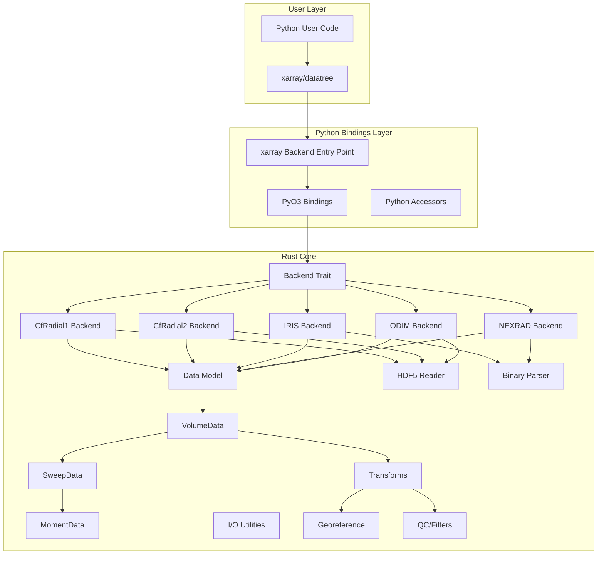
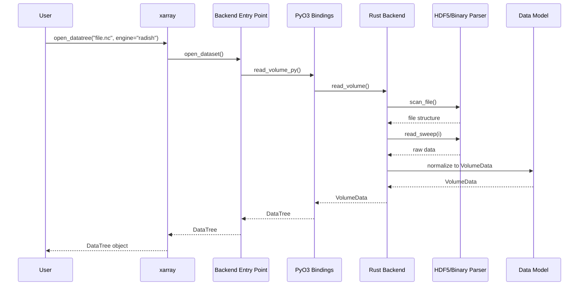
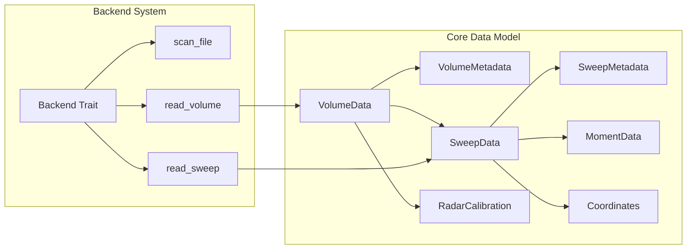
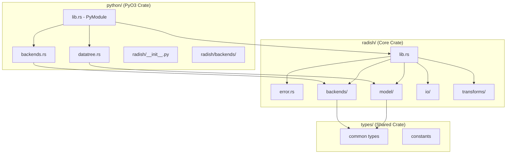
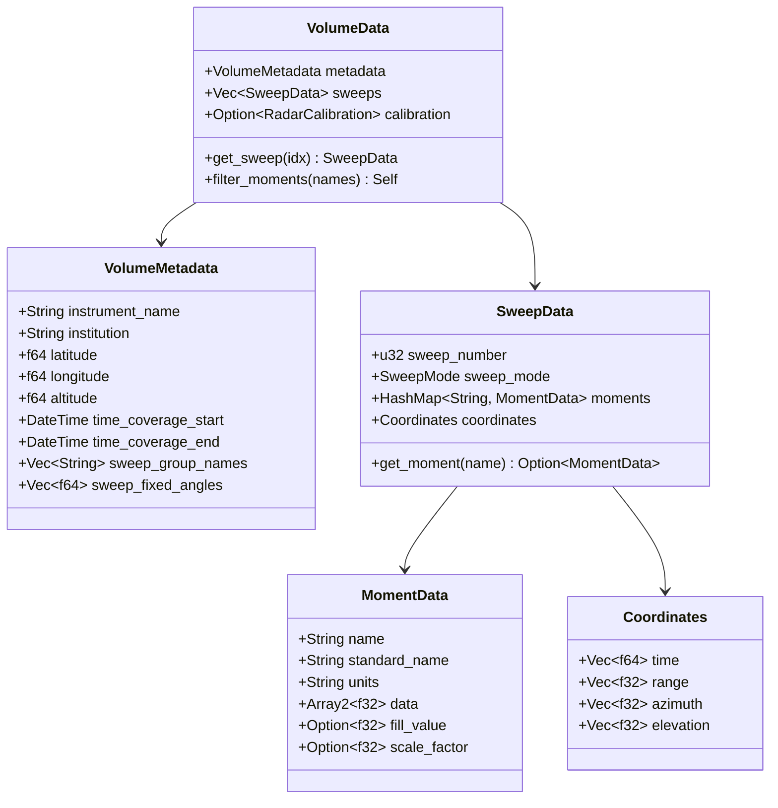

# Radish Architecture

A high-performance weather radar data library with a Rust core and Python bindings, designed for reading multiple radar formats and normalizing to the CfRadial2/FM301 standard.

## Architecture Overview



## Data Flow Architecture



## Component Architecture



## Module Structure



## Backend Implementation Pattern

Each backend follows this pattern:

1. **File Scanning**: Quick metadata extraction without loading full data
2. **Sweep Reading**: Load individual sweep data on demand
3. **Normalization**: Convert to standard VolumeData/SweepData model
4. **Validation**: Ensure data meets CfRadial2 requirements

```rust
pub trait RadarBackend: Send + Sync {
    fn name(&self) -> &str;
    fn description(&self) -> &str;
    fn supported_extensions(&self) -> &[&str];

    fn scan_file(&self, path: &Path) -> Result<VolumeMetadata>;
    fn read_sweep(&self, path: &Path, sweep_idx: usize) -> Result<SweepData>;
    fn read_volume(&self, path: &Path) -> Result<VolumeData>;
}
```

## Data Model Hierarchy



## Performance Considerations

1. **Zero-Copy Where Possible**: Use memory-mapped files for large datasets
2. **Lazy Loading**: Read sweeps on demand, not all at once
3. **Parallel Processing**: Use rayon for multi-threaded sweep processing
4. **Efficient Memory Layout**: Use ndarray for numerical data
5. **Minimal Python Overhead**: Keep hot paths in Rust

## Extension Points

1. **New Backends**: Implement `RadarBackend` trait
2. **New Transforms**: Add to `transforms/` module
3. **Custom Moments**: Extend `MomentData` types
4. **Export Formats**: Add writers alongside readers
5. **Compression**: Plug in via I/O layer

## Technology Stack

### Rust Core
- **hdf5**: HDF5 file format support
- **netcdf**: NetCDF support (CfRadial uses NetCDF-4)
- **ndarray**: Multi-dimensional arrays
- **chrono**: Date/time handling
- **thiserror**: Error handling
- **rayon**: Parallel processing
- **serde**: Serialization

### Python Bindings
- **pyo3**: Rust-Python bindings
- **numpy**: Array interop
- **maturin**: Build system
- **xarray**: Data model integration
- **datatree**: Hierarchical data structure

## Development Roadmap

### Phase 1: Foundation (Current)
- [x] Project structure
- [ ] Core data model
- [ ] Backend trait
- [ ] CfRadial1 backend
- [ ] Basic Python bindings
- [ ] xarray integration

### Phase 2: Format Support
- [ ] CfRadial2 backend
- [ ] ODIM H5 backend
- [ ] IRIS/Sigmet backend
- [ ] NEXRAD Level 2 backend

### Phase 3: Advanced Features
- [ ] Georeferencing
- [ ] Velocity dealiasing
- [ ] Quality control filters
- [ ] Format conversion/export

### Phase 4: Optimization
- [ ] Memory-mapped I/O
- [ ] Parallel sweep loading
- [ ] Streaming API
- [ ] Compression support
